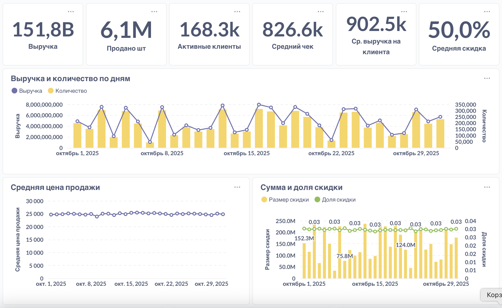

# ETL → Postgres → Metabase для маркетплейса
Код и инфраструктура для ежедневной загрузки транзакций маркетплейса через API, их хранения в PostgreSQL и визуализации в Metabase. 
В проект включены: первичная историческая загрузка, ежедневный инкремент, мониторинг, а также аналитические исследования по ассортименту и клиентской базе (LTV).

## Задача
- Собрать данные о покупках на маркетплейсе через HTTP API (по дням).
- Развернуть PostgreSQL и хранить нормализованные данные.
- Запускать ежедневную инкрементальную загрузку в 07:00 (данные за «вчера»).
- Выполнить первичную историческую загрузку всего доступного диапазона.
- Поднять Metabase и собрать операционный дашборд по продажам, ассортименту и клиентам.
- Провести 2 исследования на данных 2023 года:
-- оптимизация ассортимента и маржинальности;
-- работа с клиентской базой и рост LTV.

## Архитектура проекта
```text
API (маркетплейс)
   ↓
[ETL (Python: APIClient, pgdb, LoggerManager)]
   ↓
PostgreSQL (таблица sales)
   ↓
Metabase (дашборд, SQL-карточки)
```

## Структура проекта

```bash
etl_project/
├── etl/                           # Модули ETL-пайплайна (извлечение, загрузка, логирование)
│   ├── APIClient.py               # Подключение к API маркетплейса и получение данных
│   ├── ConfigLoader.py            # Загрузка конфигурации из config.json
│   ├── LoggerManager.py           # Централизованный логгер с ротацией логов
│   ├── pgdb.py                    # Работа с PostgreSQL (соединение, запись, upsert)
│   ├── history.py                 # Историческая загрузка данных за весь период
│   ├── run.py                     # Ежедневная загрузка данных за «вчера»
│   └── config_sample.json         # Конфигурация API и подключения к базе данных
│
├── metabase/                      # SQL-запросы и описание дашборда Metabase
│   ├── queries/                   # Все карточки Metabase сохранены в виде SQL-файлов
│   │   ├── Активные клиенты.sql
│   │   ├── Выручка.sql
│   │   ├── Выручка и количество по дням.sql
│   │   ├── Средний чек.sql
│   │   ├── Средняя цена продажи.sql
│   │   ├── Сумма и доля скидки.sql
│   │   ├── Топ-3 товара по выручке.sql
│   │   ├── Динамика выручки по топ-3 товарам.sql
│   │   ├── Товары с наибольшим ростом выручки.sql
│   │   ├── Товары с наибольшим падением выручки.sql
│   │   ├── Уникальные клиенты по полу.sql
│   │   └── Частота покупок.sql
│   └── dashboard.md               # Описание дашборда и ссылка на публичный Metabase
│
├── sql/                           # SQL-скрипты для создания и структуры таблиц
│   └── public.sales_ddl.sql       # DDL-описание таблицы sales в PostgreSQL
│
├── reports/                       # Финальные аналитические отчёты и визуализации
│   ├── 1. Анализ ассортимента и продаж.pdf
│   ├── 2. Анализ клиентской базы.pdf
│   ├── Настройка cron.png         # Пример настройки автоматического запуска
│   ├── Dashboard_1.png            # Скриншот первой части Metabase-дэшборда
│   ├── Dashboard_2.png            # Скриншот второй части Metabase-дэшборда
│   └── analysis.ipynb             # Jupyter Notebook с аналитикой и проверкой данных
│
├── requirements.txt               # Список зависимостей Python (pandas, psycopg2, requests и т.д.)
│
└── README.md                      # Основное описание проекта

## Описание данных

Таблица `public.sales` содержит данные о транзакциях маркетплейса:
| Поле | Описание |
|------|-----------|
| `client_id` | ID клиента |
| `product_id` | ID товара |
| `purchase_datetime` | Дата и время покупки |
| `quantity` | Количество |
| `price_per_item` | Цена за единицу |
| `discount_per_item` | Скидка |
| `total_price` | Итоговая сумма покупки |

Эти данные формируют основу для аналитики продаж и клиентского поведения.

## Подготовка базы данных PostgreSQL
Перед запуском ETL-процесса необходимо создать базу данных и таблицы в PostgreSQL:

1. Создайте базу данных
```sql
CREATE DATABASE etl_database;
```
Замените `etl_database` на нужное вам имя.

2. Создайте таблицы с помощью DDL-скрипта
В папке `sql/` находится файл с командами DDL для создания необходимых таблиц `public.sales_ddl.sql`. Подключитесь к вашей базе и выполните скрипт:

```bash
psql -U postgres -d etl_database -f sql/public.sales_ddl.sql
```
- `-U postgres` — имя пользователя PostgreSQL
- `-d etl_database` — имя базы данных
- `-f sql/public.sales_ddl.sql` — путь к SQL-скрипту

Убедитесь, что у вас есть доступ к `psql` из командной строки и PostgreSQL установлен локально или доступен по сети.

## Установка и запуск
1. Клонируйте репозиторий

```bash
git clone https://github.com/AgafonovaTatiana/etl_project.git
cd etl_project
```
2. Создайте и активируйте виртуальное окружение
<details> 
<summary>macOS / Linux</summary>

```bash
python3 -m venv venv
source venv/bin/activate
```
</details> 
<details> 
<summary>Windows</summary>

```cmd
python -m venv venv
venv\Scripts\activate
```
</details>

3. Установите зависимости

```bash
pip install -r requirements.txt
```
4. Настройте `config.json`
Укажите:
- настройки подключения к PostgreSQL
- имя базы данных, куда будет происходить загрузка
- endpoont API

5. Загрузите исторические данные

```bash
python history.py
```
6. Ежедневная загрузка свежих данных в базу

```bash
python run.py
```
## Автоматизация
### Linux/macOS (через `cron`):

1. Откройте редактор crontab:

```bash
crontab -e
```
2. Добавьте строку для ежедневного запуска:

```bash
0 7 * * * /path/to/venv/bin/python /path/to/run.py 
```
### Windows:

Используйте планировщик заданий, указав запуск `run.py` в нужные дни.

## Визуализация в Metabase
[Открыть публичный дашборд →](http://89.36.211.33:3000/public/dashboard/70592566-498b-43d0-a4f2-b1e929014b72?%25D0%25B4%25D0%25B0%25D1%2582%25D0%25B0=2025-10-01~2025-10-31&%25D0%25BF%25D1%2580%25D0%25BE%25D0%25B4%25D1%2583%25D0%25BA%25D1%2582=#refresh=3600)



Основные показатели:
- Выручка и количество продаж по дням  
- Активные клиенты, частота покупок, разбивка по полу  
- Скидки и средний чек  
- Топ-товары по росту и падению выручки

## Результаты анализа
- Проведён ABC-анализ ассортимента и выявлены категории с низкой рентабельностью.  
- Выполнен когортный анализ клиентов и рассчитан средний LTV.  
- Определены пиковые месяцы по выручке и скидочной активности.  
- Построен интерактивный дашборд для ежедневного мониторинга ключевых метрик.

## Используемые технологии
- Python 3.11+: requests / pandas / SQLAlchemy / psycopg2
- PostgreSQL 14+
- Metabase (Docker)
- Orchestration: cron
- Инфра: Docker для Metabase