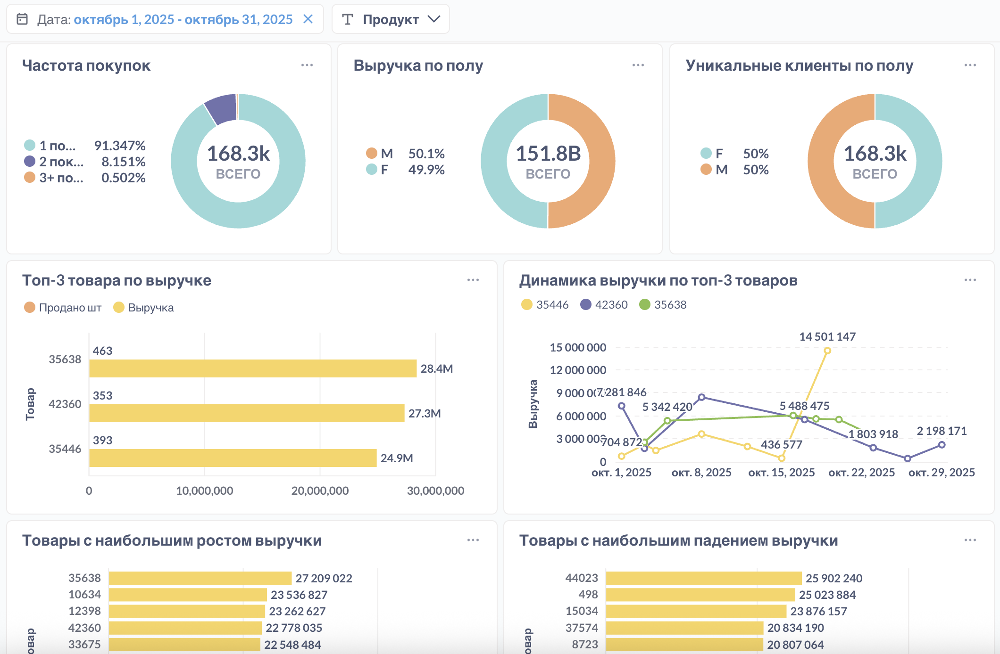

# Metabase Dashboard — Аналитика продаж и клиентов

**Публичная ссылка с предустановленным фильтром по дате и автообновлением раз в час:**  
👉 [Открыть дашборд в Metabase](http://89.36.211.33:3000/public/dashboard/70592566-498b-43d0-a4f2-b1e929014b72?%25D0%25B4%25D0%25B0%25D1%2582%25D0%25B0=2025-10-01~2025-10-31&%25D0%25BF%25D1%2580%25D0%25BE%25D0%25B4%25D1%2583%25D0%25BA%25D1%2582=#refresh=3600)

---

## Описание
Единый интерактивный дашборд для анализа данных маркетплейса:  
выручка, количество продаж, скидки, активность клиентов и динамика по товарам.

Источником данных является таблица `sales` в PostgreSQL, обновляемая ежедневно через ETL-скрипты проекта (`run.py` и `history.py`).  
Карточки дашборда построены на SQL-запросах, хранящихся в папке [`metabase/queries`](./queries/).

---

## Основные метрики

| Блок | Метрики | Ключевые показатели |
|------|----------|--------------------|
| **Общие KPI** | Выручка, Количество продаж, Активные клиенты, Средний чек, Средняя скидка
| **Динамика продаж** | Выручка и количество по дням, Средняя цена продажи, Сумма и доля скидки | Позволяет отслеживать тренды и сезонность по датам |
| **Клиентская аналитика** | Частота покупок, Выручка по полу, Уникальные клиенты по полу | Деление клиентской базы на мужскую и женскую аудитории |
| **Ассортимент и топы** | ТОП-3 товаров по выручке, Динамика по ТОП-3, Рост и падение продаж | Помогает выявить лидеров и аутсайдеров по динамике выручки |

---

## Используемые SQL-запросы

Все запросы расположены в каталоге [`metabase/queries`](./queries/).  
Основные карточки дашборда:

| Файл | Назначение |
|------|-------------|
| `Выручка и количество по дням.sql` | Динамика выручки и продаж по датам |
| `Средняя цена продажи.sql` | Средняя цена продажи по дням |
| `Сумма и доля скидки.sql` | Общая сумма скидок и их доля от выручки |
| `Выручка по полу.sql` | Разделение выручки по полу клиентов |
| `Уникальные клиенты по полу.sql` | Количество уникальных клиентов по полу |
| `Частота покупок.sql` | Распределение клиентов по числу покупок |
| `Топ-3 товара по выручке.sql` | Топ-3 товаров по объёму выручки |
| `Динамика выручки по топ-3 товарам.sql` | Динамика выручки лидирующих товаров |
| `Товары с наибольшим ростом выручки.sql` | Список товаров с наибольшим приростом продаж |
| `Товары с наибольшим падением выручки.sql` | Список товаров с наибольшим снижением выручки |
| `Активные клиенты.sql` | Подсчёт клиентов, совершивших ≥1 покупку за период |
| `Средняя скидка.sql` | Среднее значение скидки по всем продажам |
| `Средний чек.sql` | Средний чек (выручка ÷ количество заказов) |
| `Средняя выручка на клиента.sql` | Средняя выручка на одного клиента |
| `Продано шт.sql` | Количество проданных единиц товара |
| `Выручка.sql` | Общая выручка за выбранный период |

---

## Превью дашборда

### Общие метрики и динамика

### Аналитика по полу и товарам

---

## Интерпретация по данным за октябрь 2025 года

- **Пик продаж** наблюдается в середине месяца, с равномерной активностью по дням.  
- **Средняя цена** стабильна (~25 000 ₽), что говорит об отсутствии ценовых колебаний.  
- **Скидки** составляют около 50 % от суммы продаж, что может указывать на зависимость спроса от акций.  
- **Соотношение полов клиентов** практически равное (≈ 50 / 50).  
- **ТОП-3 товаров** формируют значительную долю выручки (≈ 18–20 %).  
- **Рост и падение** отдельных SKU отслеживаются карточками для быстрой реакции.

---

## Технические детали
- **Источник данных:** PostgreSQL (`sales`)  
- **Обновление данных:** ежедневно 07:00 через `run.py`  
- **Инструмент визуализации:** [Metabase](https://www.metabase.com)  

---

*Этот файл входит в репозиторий ETL-системы и описывает текущий дашборд Metabase, подключённый к базе данных проекта.*
